## What is K-Means ?
**K-Means** is a clustering algorithm that partitions a set of data points into k clusters (Figure). The k-means clustering algorithm is commonly used on large datasets, and due to the characteristics of the algorithm characteristics of the algorithm, this algorithm is a good candidate for parallelization. 

## How does it work ? 
There are several steps to explain it. For explanation, there is data provided below :
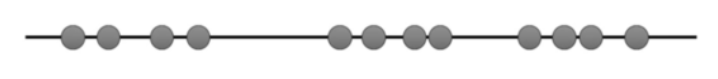

Here, I will explain step by step how k-means works

#### Step 1. Determine the value “K”, the value “K” represents the number of clusters.

In our case, we’ll select K=3. That is to say, we want to identify 3 clusters. Is there any way to determine the value of K? yes there is, but we wont talk about it here.

#### Step 2. Randomly select 3 distinct centroid (new data points as cluster initialization)

for example — attempts 1. “K” is equal 3 so there are 3 centroid, in which case it will be the cluster initialization

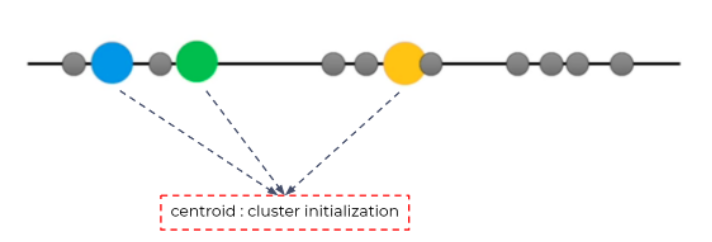

#### Step 3. Measure the distance (euclidean distance) between each point and the centroid

for example, measure the distance between first point and the centroid.

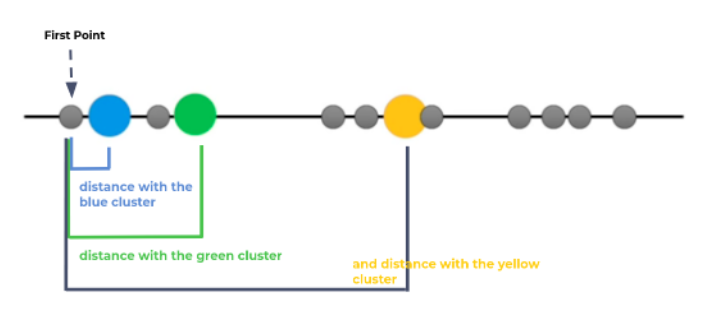

#### Step 4. Assign the each point to the nearest cluster

for example, measure the distance between first point and the centroid.

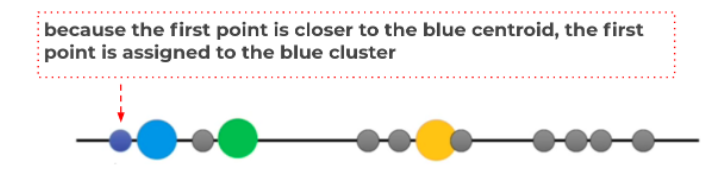

Do the same treatment for the other unlabeled point, until we get this

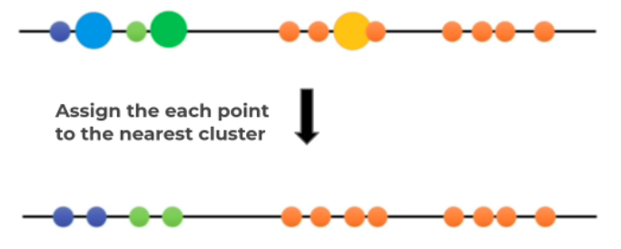

#### Step 5. Calculate the mean of each cluster as new centroid

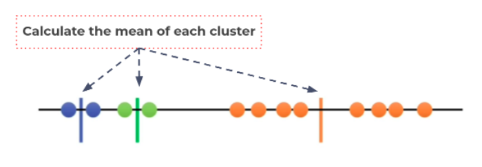

Update the centroid with mean of each cluster

#### Step 6. Repeat step 3–5 with the new center of cluster

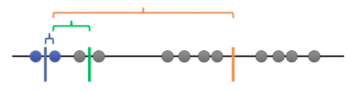

Repeat until stop:
 - Convergence. (No further changes)
 - Maximum number of iterations.

**Since the clustering did not change at all during the last iteration, we’re done.**

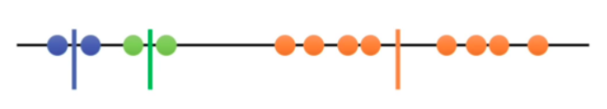

## Implementation

The goal of this of this exercise is to implement k-means using Hadoop MapReduce.

In this Implementation, we'll cluster a **brain MRI image**.

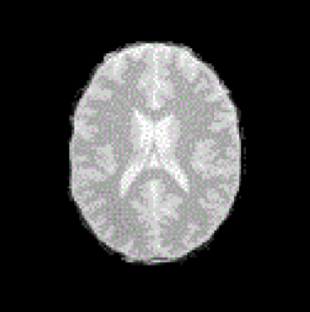

The image is in grid level (grayscale image) where the value of each pixel is between 0 and 255 (0 represents the black color and 255 represents the white color), this image shows three parts of the brain, namely **the white matter**, **the gray matter** and **cerebrospinal fluid**, *the objective* is to know the pixels of each part.
To do this you have to load the image to be stored in HDFS, then classify the image into three clusters, you also have to create a file **centersRMI.txt** file that contains three values of the initial centroids.
The output of the program will be something like this :

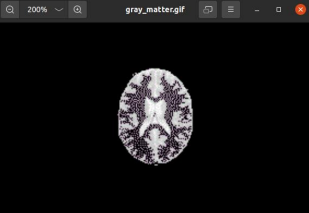
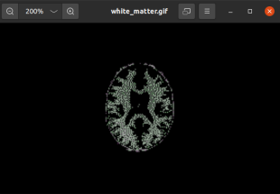
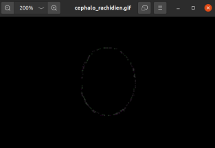

**cerebrospinal fluid** doesn't look like this in reality, its because of the image we clustered isn't very clear.
